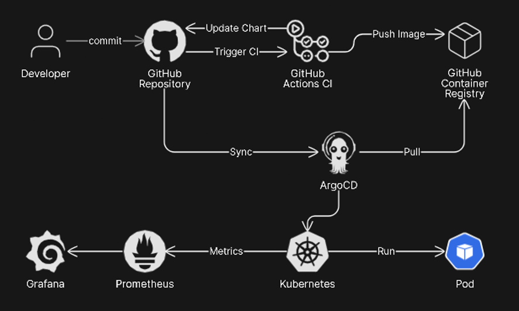
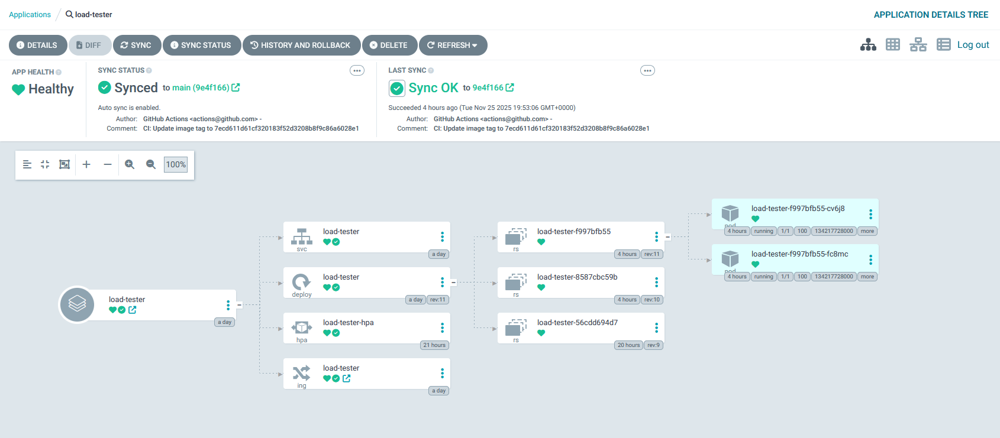
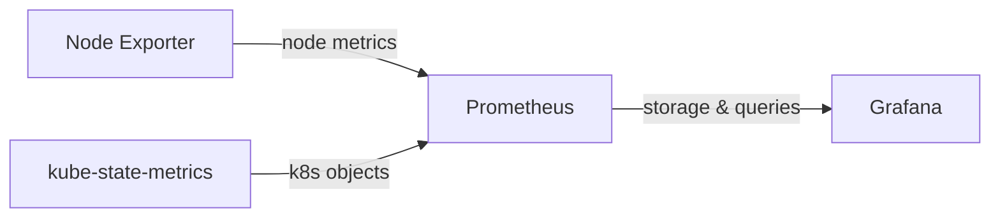
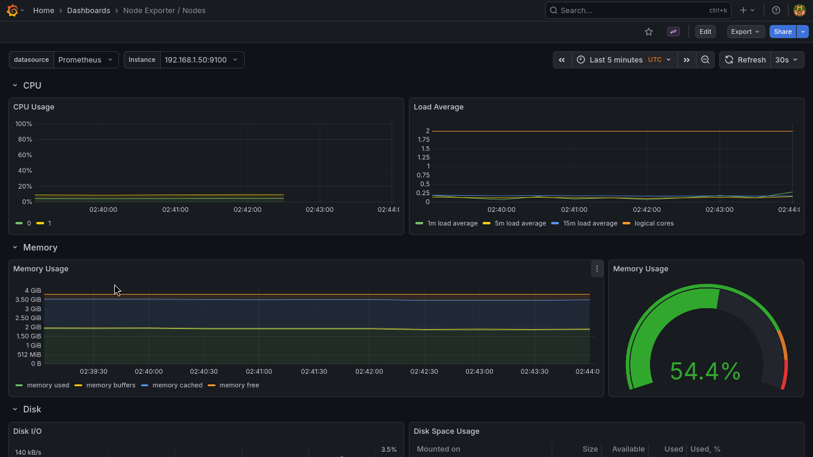
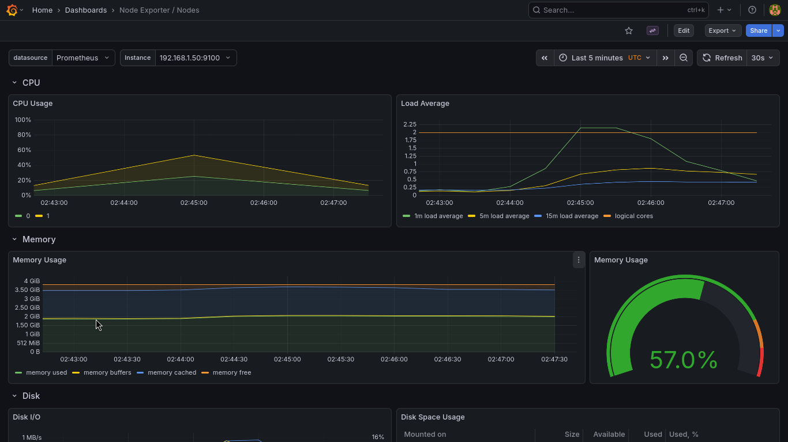

# Kubernetes CI/CD Pipeline with GitOps

- [Overview](#overview)
- [Architecture Design](#architecture-design)
- [CI Pipeline](#ci-pipeline)
- [GitOps Workflow](#gitops-workflow)
- [Monitoring & Auto-scaling](#monitoring--auto-scaling)
  - [Monitoring Stack](#monitoring-stack)
  - [Load Generation & HPA](#load-generation--hpa)
- [Future Improvements](#future-improvements)

## Architecture Design

## Overview

Objective:​‍​‌‍​‍‌​‍​‌‍​‍‌ Experience the actual process of using the GitOps method to deliver an application to Kubernetes.\
I wanted to create the whole flow from committing to the repository and automatic deployment to the cluster and figure out how everything works together: CI/CD, GitOps, monitoring, autoscaling.

This is a learning experiment that helped me understand modern DevOps tools and how their interconnectivity.

## CI Pipeline
Automated Build, Test, and Deployment Preparation with GitHub Actions.
The [workflow](./.github/workflows/contiuous-integration.yaml) is triggered by pushes and pull requests to the main branch, ignoring changes to the documentation. .

### Trigger conditions:
- Push or pull request to main (excluding 'docs/**' and '.github/**')
- Source code changes ('src/**') - additional trigger

### Jobs
- **<ins>change</ins>**: Uses path-based filtering to detect changes in source code, allowing conditional execution of downstream jobs
- **<ins>lint</ins>**: Validates Dockerfile and Helm chart for correctness and best practices using Hadolint and Charm testing action
- **<ins>build</ins>**: Builds application image with Docker Buildx and pushes to GitHub Container Registry (GHCR)
- **<ins>test</ins>**: Executes only when source files change - builds and runs the application, then performs basic HTTP availability checks
- **<ins>update-chart</ins>**: On successful job completion, updates the Helm chart with the new image tag, triggering ArgoCD to start the CD process

## GitOps Workflow
Automated Deployment and Synchronization with ArgoCD.
The​‍​‌‍​‍‌​‍​‌‍​‍‌ ArgoCD Application keeps an eye on the Git repository all the time and along with this, automatically synchronizes the Kubernetes cluster with Helm charts according to [argocd-load-tester-app.yaml](infrastructure/argocd/argocd-load-tester-app.yaml) configuration file.

### Process
- Git Monitoring: ArgoCD tracks the Helm chart directory in the repo and acts on any changes 
- Automated Sync: Upon the reception of new commits to the chart, ArgoCD is automatically brought to the cluster state
- Self-Healing: In case the resources have drifted from the configuration stored in Git, ArgoCD will recover the desired state 




## Monitoring & Auto-scaling
### Monitoring Stack
Comprehensive observability stack offering real-time metrics collection and visualization.
kube-prometheus-stack set up with Helm. For the load-tester application, we set up a ServiceMonitor that configures Prometheus to collect metrics from the application pods, which allows to visualise the data in Grafana.

**Data Flow**



### Load Generation & HPA
Automated scaling based on real-time application metrics through Horizontal Pod Autoscaler.

### Application Design
The test application is a C web server combined with stress-ng for resource load testing:
Key endpoints:
- /cpu - CPU-intensive operation
- /memory - Memory allocation test
- /stop - Terminate active tests

### HPA Configuration
Horizontal Pod Autoscaler configured via values.yaml:
```yaml
autoscaling:
  enabled: true
  minReplicas: 2
  maxReplicas: 5
  targetCPUUtilizationPercentage: 80
  targetMemoryUtilizationPercentage: 80
```

#### Scaling Demonstration
**Initial state:**
```bash
$ kubectl get hpa --watch
NAME              REFERENCE                TARGETS                       MINPODS   MAXPODS   REPLICAS   AGE
load-tester-hpa   Deployment/load-tester   cpu: 0%/80%, memory: 0%/80%   2         5         2          23h
load-tester-hpa   Deployment/load-tester   cpu: 0%/80%, memory: 0%/80%   2         5         2          23h
```
**Load Generation:**
```bash
$ curl http://load-tester.local/cpu
CPU stress-ng started
```
**Scaling in Action:**
```bash
$ kubectl get hpa -w
NAME              REFERENCE                TARGETS                       MINPODS   MAXPODS   REPLICAS   AGE
load-tester-hpa   Deployment/load-tester   cpu: 0%/80%, memory: 0%/80%   2         5         2          23h
load-tester-hpa   Deployment/load-tester   cpu: 0%/80%, memory: 0%/80%   2         5         2          23h
load-tester-hpa   Deployment/load-tester   cpu: 158%/80%, memory: 8%/80%   2         5         2          23h
load-tester-hpa   Deployment/load-tester   cpu: 500%/80%, memory: 8%/80%   2         5         2          23h
load-tester-hpa   Deployment/load-tester   cpu: 497%/80%, memory: 8%/80%   2         5         2          23h
load-tester-hpa   Deployment/load-tester   cpu: 497%/80%, memory: 8%/80%   2         5         2          23h
load-tester-hpa   Deployment/load-tester   cpu: 495%/80%, memory: 8%/80%   2         5         2          23h
load-tester-hpa   Deployment/load-tester   cpu: 496%/80%, memory: 8%/80%   2         5         4          23h
load-tester-hpa   Deployment/load-tester   cpu: 495%/80%, memory: 4%/80%   2         5         5          23h
load-tester-hpa   Deployment/load-tester   cpu: 0%/80%, memory: 0%/80%     2         5         2          23h
load-tester-hpa   Deployment/load-tester   cpu: 0%/80%, memory: 0%/80%     2         5         4          23h
load-tester-hpa   Deployment/load-tester   cpu: 0%/80%, memory: 0%/80%     2         5         5          23h
load-tester-hpa   Deployment/load-tester   cpu: 0%/80%, memory: 0%/80%     2         5         5          23h
```
**HPA events:**
```bash
$ kubectl describe hpa
Name:                                                     load-tester-hpa
Namespace:                                                default
Labels:                                                   <none>
Annotations:                                              argocd.argoproj.io/tracking-id: load-tester:autoscaling/HorizontalPodAutoscaler:default/load-tester-hpa
CreationTimestamp:                                        Tue, 25 Nov 2025 02:58:53 +0000
Reference:                                                Deployment/load-tester
Metrics:                                                  ( current / target )
  resource cpu on pods  (as a percentage of request):     0% (0) / 80%
  resource memory on pods  (as a percentage of request):  0% (194560) / 80%
Min replicas:                                             2
Max replicas:                                             5
Deployment pods:                                          2 current / 2 desired
Conditions:
  Type            Status  Reason            Message
  ----            ------  ------            -------
  AbleToScale     True    ReadyForNewScale  recommended size matches current size
  ScalingActive   True    ValidMetricFound  the HPA was able to successfully calculate a replica count from memory resource utilization (percentage of request)
  ScalingLimited  True    TooFewReplicas    the desired replica count is less than the minimum replica count
Events:
  Type     Reason                        Age                    From                       Message
  ----     ------                        ----                   ----                       -------
  Warning  FailedGetResourceMetric       28m (x5 over 7h32m)    horizontal-pod-autoscaler  failed to get cpu utilization: did not receive metrics for targeted pods (pods might be unready)
  Warning  FailedGetResourceMetric       28m (x3 over 6h50m)    horizontal-pod-autoscaler  failed to get memory utilization: did not receive metrics for targeted pods (pods might be unready)
  Warning  FailedComputeMetricsReplicas  28m (x3 over 6h50m)    horizontal-pod-autoscaler  invalid metrics (2 invalid out of 2), first error is: failed to get cpu resource metric value: failed to get cpu utilization: did not receive metrics for targeted pods (pods might be unready)
  Normal   SuccessfulRescale             28m                    horizontal-pod-autoscaler  New size: 4; reason: memory resource utilization (percentage of request) above target
  Normal   SuccessfulRescale             11m (x15 over 6h49m)   horizontal-pod-autoscaler  New size: 4; reason: cpu resource utilization (percentage of request) above target
  Normal   SuccessfulRescale             11m (x7 over 7h1m)     horizontal-pod-autoscaler  New size: 5; reason: cpu resource utilization (percentage of request) above target
  Normal   SuccessfulRescale             7m59s (x6 over 6h45m)  horizontal-pod-autoscaler  New size: 4; reason: All metrics below target
  Normal   SuccessfulRescale             7m44s (x5 over 6h44m)  horizontal-pod-autoscaler  New size: 5; reason: All metrics below target
  Normal   SuccessfulRescale             2m58s (x6 over 6h42m)  horizontal-pod-autoscaler  New size: 3; reason: All metrics below target
  Normal   SuccessfulRescale             2m43s (x3 over 6h39m)  horizontal-pod-autoscaler  New size: 2; reason: All metrics below target

```
**Grafana Dashboard:**




## Future Improvements
- Separate Stage/Prod clusters
- Create deployment documentation  
- Implement microservices architecture
- Try alternative technologies